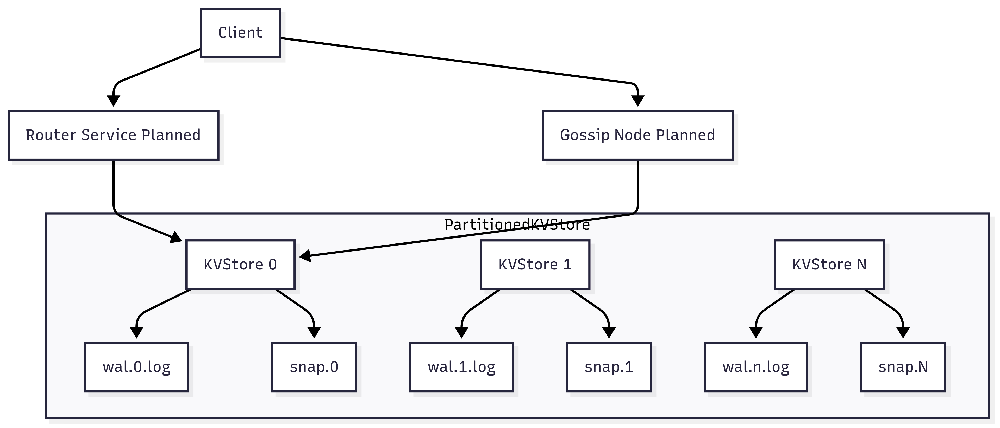

# Thread-safe Key-Value Store in Modern C++

A high-performance, thread-safe, write-ahead-logged in-memory key-value store written in modern C++17. Designed with modularity, safety, and extensibility in mind — it's built to support TTL-based keys, durable logging, automatic snapshotting, partitioning, and future horizontal scaling via **Router-based routing** and **Gossip Protocol**.

> 📍 This project is part of my deep dive into distributed systems and backend engineering fundamentals.

---

## 📌 Features

- ✅ **Thread-safe operations** using `std::shared_mutex` for safe concurrent access
- 🧵 **Custom ThreadPool** using `std::thread`, `std::condition_variable`, `std::packaged_task`
- 💾 **Write-Ahead Logging (WAL)** for durable recovery
- ⏳ **TTL (Time-to-Live)** for keys with automatic cleanup
- 💡 **Snapshotting** to reduce WAL size and support cold-start recovery
- 🧼 **Background threads** for TTL cleanup & snapshots (with fast wakeup using `condition_variable`)
- 🧪 **Comprehensive unit tests** via GoogleTest
- 🧱 **Partitioned KV Store** using `PartitionedKVStore.hpp`
- 🔁 **Planned cluster protocols:**
  - 📡 **Router-Based Coordination**
  - 📢 **Gossip Protocol-Based Peer Discovery**

---

## 📐 System Architecture



---

## 🧱 Folder Structure

```
Thread-safe-kv/
├── shard_node/
│   ├── kvstore.cpp / .hpp         # WAL + snapshot + TTL key-value store
│   ├── wal.cpp / .hpp             # Write-Ahead Log implementation
│   ├── PartitionedKVStore.hpp     # Partition-aware in-process abstraction
│   ├── thread_pool.hpp            # Generic thread pool with task queue
│   └── thread_task.hpp            # Task interface abstraction
├── tests/                         # GoogleTest-based unit tests
├── CMakeLists.txt                 # Build configuration
└── README.md                      # This file
```

---

## 🧠 Key Concepts Demonstrated

### ✅ Thread-Safe KVStore

* Fine-grained locking with `shared_mutex` for high concurrency.
* Separate synchronization primitives for data vs. control (`condition_variable` for shutdown).

### ✅ WAL + Snapshot Design

* WAL is flushed on every operation.
* Periodic snapshots write in-memory state to disk.
* WAL is truncated after snapshot to prevent bloat.

### ✅ Modular ThreadPool

* Decoupled tasks (`ThreadTaskBase`) from pool logic.
* Clean shutdown and task tracking support.

### ✅ Partitioning Support

* `PartitionedKVStore` allows pluggable sharding logic.
* Each partition uses its own WAL + snapshot.
* Foundation for distributed coordination.

---

## 🚧 Challenges Faced & Learnings

| Challenge                                           | What I Learned                                                                                                |
| --------------------------------------------------- | ------------------------------------------------------------------------------------------------------------- |
| ❌ WAL was not writing                               | Threads were starting during object construction — fixed by deferring start using a static `create()` method. |
| 🧵 Snapshot thread slow to shutdown                 | Used `std::condition_variable` to wake it early — massive improvement in responsiveness.                      |
| 🔒 Potential deadlocks                              | Separated mutex for signaling vs. data protection. No more nested locks.                                      |
| 💣 Shared mutex not accepted by condition\_variable | Refactored to use `std::mutex` for signaling — matched `wait_for` API correctly.                              |
| 📄 `ofstream::flush` unclear behavior               | Ensured `flush()` was called after every WAL write.                                                           |
| 🧪 WALRecovery test failed                          | Understood lifecycle better, simplified init flow, made recovery deterministic.                               |
| 🧱 Object ownership patterns                        | Used `std::unique_ptr<KVStore>` with static creation for safety.                                              |

---

## 🔮 Upcoming Milestones

### gRPC interface for KV store client/nodes communication

- Exposes a type-safe, efficient remote API for all KVStore operations using gRPC and Protocol Buffers.
- Supports core commands: `Put`, `Get`, `Remove` with optional TTL for flexible key expiry.
- Enables both client-to-node access (for external applications) and node-to-node communication (for replication and cluster coordination).
- Auto-generates C++ (and other language) client/server stubs from the provided `.proto` contract.
- Provides clear error reporting and strong schema guarantees for cross-language integration.
- Future-ready for streaming, batch operations, and internal cluster protocols (e.g., Replicate) by extending the `.proto` file.
- Operates over HTTP/2 for improved performance, multiplexing, and modern transport features.
- Includes example `.proto` file and setup instructions for code generation and integration.

### 🔗 Router-Based Cluster Coordination (Planned)

A centralized or hash-based router service that:

* Accepts client requests
* Routes them to appropriate shard (`KVStore`) based on key
* Offers **static partitioning** or **consistent hashing**
* Scalable via load balancers or replicas

### 🗣️ Gossip Protocol (Planned)

A decentralized peer discovery and membership system:

* Each node tracks a few neighbors
* Gossip messages exchanged periodically
* Used for **eventual consistency**, **failure detection**, and **auto scaling**
* Will be built on top of UDP or a TCP-based heartbeating layer

### 🛠️ Other Plans

* [ ] Client CLI for distributed testing
* [ ] Metrics dashboard (prometheus/grafana)
* [ ] WAL compaction logic
* [ ] GitHub Actions for CI/CD

---

## 🧪 Running the Tests

```bash
cmake -B build .
cmake --build build
cd build
ctest --output-on-failure
```

---

## 🧪 Sample Code Usage

```cpp
auto store = KVStore::create("wal.log");
store->put("key", "value");
store->put("temp", "value", 3000);  // TTL 3s
auto result = store->get("key");    // Returns std::optional
store->remove("temp");
store->shutdown();
```

---

## 🛠️ Tech Stack

| Tool                                                | Use                  |
| --------------------------------------------------- | -------------------- |
| `C++17`                                             | Core logic           |
| `std::thread`, `shared_mutex`, `condition_variable` | Concurrency          |
| `ofstream`, `ifstream`                              | Logging and recovery |
| `GoogleTest`                                        | Unit tests           |
| `CMake`                                             | Cross-platform build |
| `MinGW / GCC`                                       | Compiler toolchain   |

---

## 🤝 Contributions & Feedback

If you're a:

* Systems engineer
* Backend expert
* Distributed systems enthusiast

...I'd love your thoughts on design, architecture, and robustness! PRs and discussions are welcome.

---

## 🧑‍💻 Author

**Rishabh Rathore**
Software Engineer | Distributed Systems Enthusiast
📫 [LinkedIn](www.linkedin.com/in/rishabh-rathore-a9f61995) • [GitHub](https://github.com/rishabh-9695)

---

## 📜 License

MIT — use it, modify it, learn from it.

